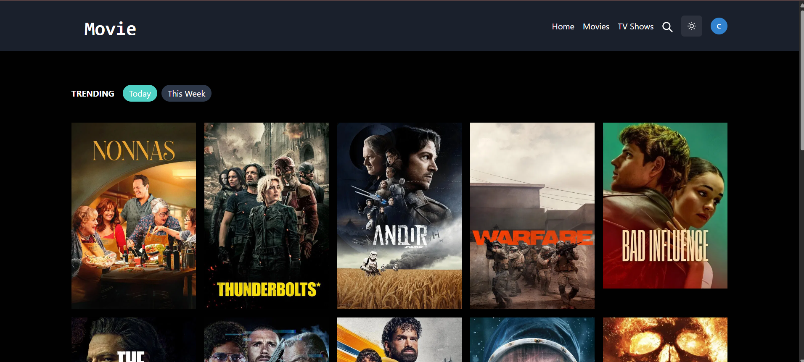
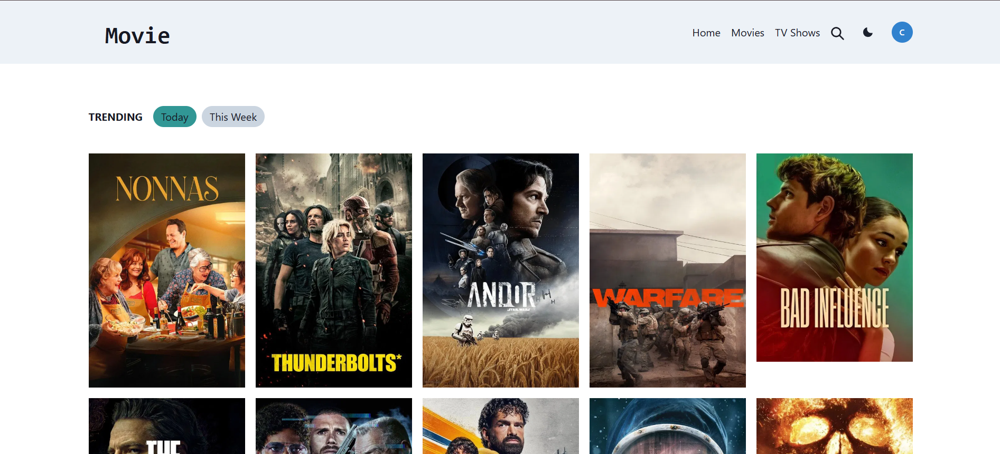
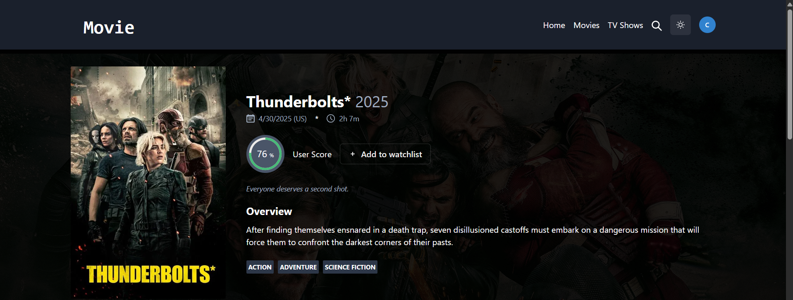
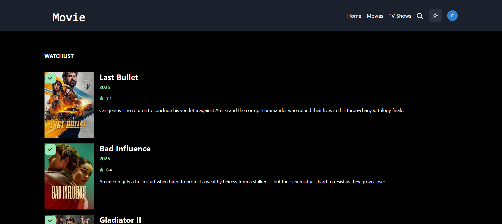

# React Movie App

A movie and TV show discovery application built with React, Firebase, Chakra UI, and the TMDB API. This app allows users to browse trending movies and TV shows, view detailed information, and manage a personalized watchlist.

---

## Features

- **Trending Movies and TV Shows**: Discover the latest trending content.
- **Detailed Information**: View detailed information about movies and TV shows, including cast, trailers, and ratings.
- **Watchlist Management**: Add or remove movies and TV shows from your watchlist.
- **Light and Dark Mode**: Seamless theme switching using Chakra UI.
- **Responsive Design**: Fully responsive UI for desktop and mobile devices.
- **Authentication**: User authentication with Firebase for personalized watchlists.

---

## Technologies Used

- **React**: Frontend framework for building the user interface.
- **Firebase**: Backend for user authentication and watchlist management.
- **Chakra UI**: Component library for styling and theming.
- **TMDB API**: Source for movie and TV show data.

---

## Installation

1. Clone the repository:
   ```bash
   git clone https://github.com/your-username/react-movie-app.git
   cd react-movie-app

2. Install dependencies:
   ```bash
   npm install

3.Create a .env file in the root directory and add the following environment variables:

REACT_APP_TMDB_API_KEY=your_tmdb_api_key
REACT_APP_FIREBASE_API_KEY=your_firebase_api_key
REACT_APP_FIREBASE_AUTH_DOMAIN=your_firebase_auth_domain
REACT_APP_FIREBASE_PROJECT_ID=your_firebase_project_id
REACT_APP_FIREBASE_STORAGE_BUCKET=your_firebase_storage_bucket
REACT_APP_FIREBASE_MESSAGING_SENDER_ID=your_firebase_messaging_sender_id
REACT_APP_FIREBASE_APP_ID=your_firebase_app_id

4. Start the development server:

npm start

The section you provided has formatting and content issues. Here's the corrected version of the problematic part of your README.md file:

---

### **Corrected Section**

```markdown
2. Install dependencies:
   ```bash
   npm install
   ```

3. Create a `.env` file in the root directory and add the following environment variables:
   ```env
   REACT_APP_TMDB_API_KEY=your_tmdb_api_key
   REACT_APP_FIREBASE_API_KEY=your_firebase_api_key
   REACT_APP_FIREBASE_AUTH_DOMAIN=your_firebase_auth_domain
   REACT_APP_FIREBASE_PROJECT_ID=your_firebase_project_id
   REACT_APP_FIREBASE_STORAGE_BUCKET=your_firebase_storage_bucket
   REACT_APP_FIREBASE_MESSAGING_SENDER_ID=your_firebase_messaging_sender_id
   REACT_APP_FIREBASE_APP_ID=your_firebase_app_id
   ```

4. Start the development server:
   ```bash
   npm start
   ```

---

## Folder Structure

```
src
├── components
│   ├── Navbar.jsx
│   ├── CardComponent.jsx
│   ├── WatchlistCard.jsx
│   └── PaginationComponent.jsx
├── pages
│   ├── Home.jsx
│   ├── DetailsPage.jsx
│   ├── Watchlist.jsx
│   └── shows
│       └── Shows.jsx
├── services
│   ├── api.js
│   └── firestore.js
├── context
│   └── useAuth.js
└── App.js
```

---

## API Integration

### TMDB API
- **Base URL**: `https://api.themoviedb.org/3`
- **Endpoints Used**:
  - `/trending/{media_type}/{time_window}`
  - `/movie/{movie_id}`
  - `/tv/{tv_id}`
  - `/search/movie`
  - `/search/tv`

### Firebase
- **Used for**:
  - User authentication
  - Storing and managing user watchlists

---

## Available Scripts

In the project directory, you can run:

- `npm start`: Runs the app in development mode.
- `npm run build`: Builds the app for production.
- `npm test`: Launches the test runner.

---

## Screenshots

### Home Page



### Details Page


### Watchlist

```

---

### **Key Fixes**
1. **Environment Variables**:
   - Added proper formatting for the .env file section.

2. **Folder Structure**:
   - Fixed indentation and ensured the structure is clear and consistent.

3. **API Integration**:
   - Corrected the TMDB API endpoints and ensured they are properly formatted.

4. **Available Scripts**:
   - Added proper formatting for the commands.

5. **Screenshots**:
   - Used consistent formatting for the screenshot section.

This corrected section should now work properly in your README.md file. Let me know if you need further adjustments!